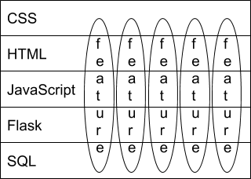

# Projecten

Dit vak kent een open eindproject waar jullie een eigen creatieve invulling aangeven. Dat betekent dat je een geheel eigen idee kan uitwerken in de laatste twee weken van het vak. Tegelijkertijd is dit een kort vak met veel nieuwe stof, en dat maakt het lastig in te schatten wat er zoal kan in twee weken. Daarom vind je hieronder drie templates om je inspiratie te geven voor je eigen project. Deze templates zijn uitdagend, maar ook haalbaar in korte tijd. 

## Templates

- **Photo sharing**. Gebruikers kunnen publiekelijk foto's posten met of zonder begeleidende tekst. Alle gebruikers kunnen elkaar "volgen" en zo de foto's bekijken en 💕. Gebruikers kunnen in plaats van een eigen foto ook een gif zoeken uit een online API zoals die van <http://api.giphy.com>
    1. Een **tijdlijn** of **gallerij** waarop meerdere foto's te bekijken zijn.
    2. Een **foto-beheer** mogelijkheid, waarbij foto's kunnen worden toegevoegd en ook worden verwijderd.
    3. Een **publiek gebruikersprofiel** waarop gebruikers elkaars foto's kunnen zien, en de ingelogde gebruiker de mogelijkheid heeft haar profiel aan te passen.
    4. Een **comments-systeem** waarmee ingelogde gebruikers d.m.v. tekst en gif-jes vanuit een online API kunnen reageren op elkaars foto's.
    5. Een **like-systeem en/of volg-systeem** waarbij gebruikers de mogelijkheid hebben foto's en andere gebruikers te "liken".

- **Collectioneur**. Gebruikers kunnen op basis van diverse eigenschappen zoeken naar items die afkomstig zijn uit een online database van *fijne dingen* zoals [recepten](http://developer.edamam.com) of [kunstwerken](http://rijksmuseum.github.io). Ze kunnen favorites opslaan op een publieke pagina en ze kunnen andere gebruikers tippen.
    1. Een **overzichtspagina** waarop de verschillende items te zien zijn.
    2. Een **zoekfunctie** waarmee een gebruiker de items kan doorzoeken.
    3. Een **publieke verzameling** waarop een gebruiker items kan bijhouden.
    4. Een **tip-functie** waarmee gebruikers elkaar kunnen tippen van zowel items als verzamelingen.
    5. Een **upload-mogelijkheid** waarmee gebruikers hun eigen items kunnen toevoegen aan de verzameling.

- **Trivia**. Gebruikers kunnen triviavragen beantwoorden en op die manier punten scoren. Er is een interessant systeem om van andere gebruikers te winnen. De vragen komen uit een online triviadatabase zoals <http://jservice.io>.
    1. Een **vraagpagina** waarop een gebruiker een triviavraag kan beantwoorden.
    2. Een **quizpagina** waarop een gebruiker een quiz kan samenstellen.
    3. Een **highscore-pagina** waarop de scores zowel per quiz als per gebruiker zichtbaar zijn.
    4. Een **eigen-vraag-pagina** waarmee er een vraag kan worden toegevoegd aan de database.
    5. Een **competitie-pagina** dezelfde quiz kunnen maken met een eigen highscore-pagina.

Ieder template kent vijf losse features en het is de taak aan ieder lid van de groep om één feature uit te werken. Deze features zijn expres verticaal, dat houdt in dat alle features ieder deel van de *technology stack* raken. Ofwel, iedere feature heeft een deel front-end werk, een deel back-end en ook effect op het database ontwerp.  

De templates zijn een groffe invulling van een project. Het is aan je team om dit concreet uit te werken tot een duidelijk concept. Het is daarbij belangrijk dat je goed nadenkt over een leuke niche en wie precies de doelgroep vormt.

## Inspiratie

Hieronder vind je verschillende projectideeën van voorgaande jaren die allemaal erg goed uitpakten. Het is okee om met één van deze ideeën aan de haal te gaan, maar het is natuurlijk leuker om je eigen idee uit te werken:

* Spotiwy (Koen, Jonne, Jesse & Thomas, 2020): "De onenigheid over muziek op bijvoorbeeld feestjes oplossen" door een gezamenlijke spotify playlist op te stellen via een website tijdens het feestje. Gebruikers kunnen een pagina opzetten en de unieke url delen. Op deze pagina kan er op nummers worden gezocht en worden toegevoegd aan een afspeellijst. Deze afspeellijst wordt via de spotify-api aangemaakt en bijgehouden. Ook kunnen gebruikers stemmen op nummers waardoor ze hoger (eerder) in de afspeellijst komen.

* What the fridge (Jesse, Rico, Stijn & Huib, 2020) & Smart Cooking (Jill, Gijs, Miro & Talia, 2019) "recepten vinden met ingrediënten die je in huis hebt" door op basis van de ingedriënten in de koelkast te zoeken naar recepten die geheel of bijna gemaakt kunnen worden.

* Sociaal dierenasiel "voor meer aandacht voor de dieren van het asiel". Een sociaal netwerk waarop de dieren van het asiel worden vertegenwoordigd. Daarop kunnen verzorgers posten en gebruikers reageren. Na adoptie krijgt de nieuwe eigenaar toegang tot het account om zo de dieren voor langere tijd te kunnen volgen.

## Wat te doen

Spring met je groepje in een Zoom-sessie en overleg jullie idee voor een project. Werk dit idee uit tot een "elevator-pitch" van 60 seconden. In die 60 seconden moet je een ander (lees je mentor, je studiegenoot, je beste vriendin en je ouders) kunnen overtuigen van je idee. Het moet daaruit duidelijk worden voor wie je applicatie is bedoelt (de doelgroep) en welk probleem er wordt opgelost. 

Druk nu op de recordknop in Zoom en neem in maximaal (harde grens) 60 seconden je elevator-pitch op. Misschien dat je het een keertje opnieuw wilt doen, maar doe het niet vaker dan dat. Upload je video hier: https://video.uva.nl/ en deel de video-url samen met de naam van je project in het slack kanaal van jouw groep op [webik.slack.com](https://webik.slack.com).

Vervolgens wordt je pitch bekeken en krijg je van ons feedback en vragen naar aanleiding van je idee. Tijdens het eerste voortgangsgesprek wordt dit in detail besproken.
