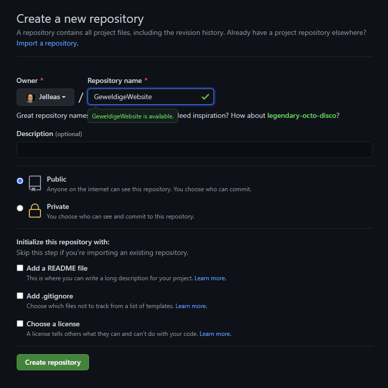
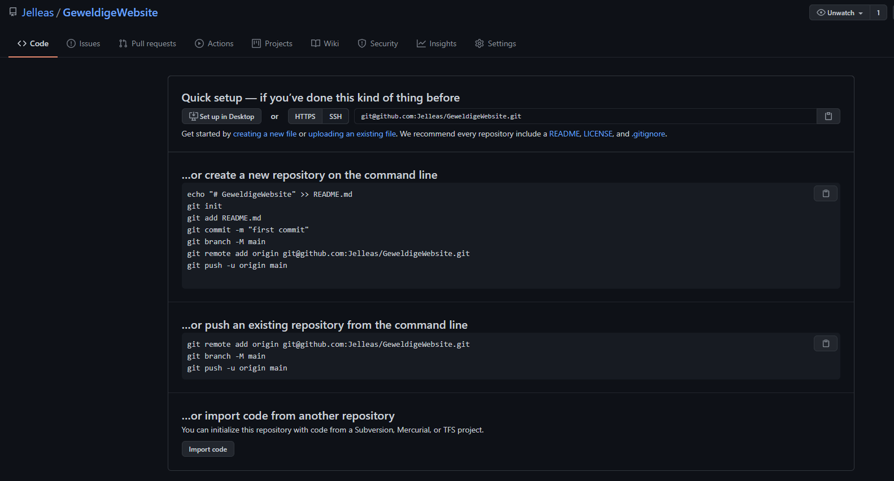

# Bootstrappen van het project

Niet te verwarren met [de gelijknamige library](https://getbootstrap.com/), is bootstrappen de eerste stap van het project. Hier ga je ervoor zorgen dat iedereen in het team een draaiende versie van de website voor zich heeft, en daaraan kan bijdragen. Dat is een kwestie van de juiste software en packages installeren, en ook de code met elkaar delen. Dit gaat nooit helemaal soepel, want iedereen heeft een andere machine voor zich. Daarom ga je voor deze milestone in een Zoom-sessie met je teamgenoten zodat jullie elkaar kunnen helpen. Kom je er nou niet uit, dan is het direct taak om contact met een assistent op te nemen via de hands.

## Finance

Vorige week hebben jullie allemaal een versie van Finance geïmplementeerd. Dit wordt het beginpunt van de website, het eerste raamwerk waar je vanaf gaat bouwen. Zo heb je meteen een initiële database, een homepagina en een loginscherm. Dat maakt het mogelijk dat je samen kan werken, zonder elkaar op elk punt in de weg te zitten. Allereerst zul je moeten kiezen welke Finance project de basis gaat vormen. Kijk even naar elkaars code en maak die keuze.

## Git

De volgende stap is de code met elkaar te delen. Dit doe je via `git`, zie ook [de lecture](/lectures/git) en [de naslag](/naslag/git). Git zul je waarschijnlijk moeten installeren. Hoe je dat doet hangt af van wat voor besturingssysteem je gebruikt. 

Voor Windows kan je `git` hier downloaden: [git-scm.com/downloads](https://git-scm.com/downloads) en daarvandaan installeren. 

Op de Mac raden we het gebruik van Homebrew aan, dit kan je hier downloaden: [brew.sh](https://brew.sh/). Homebrew is een zogenaamde package manager. Een programma dat packages (andere programma's) kan installeren, updaten en verwijderen. Zo kan je na het installeren van homebrew git installeren met het simpele commando:

        brew install git

En ook weer oninstalleren met:

        brew uninstall git

Onder Linux vertrouwen we erop dat je zelf de beste weg vindt. Het hangt nou eenmaal af van welke distributie je draait en hoe je zelf het systeem wilt onderhouden. Natuurlijk kan je ons wel om hulp vragen!

## GitHub

De volgende stap is om de code op een locatie te zetten waardoor je teamgenoten (en wij) er ook bij kunnen. Hiervoor gebruiken we bij dit vak GitHub en dit is de plek om een nieuwe repository aan te maken: [github.com/new](https://github.com/new). Let op, maar één teamgenoot hoeft dit te doen. Eigenlijk hoef je alleen de repository een naam te geven:

> Je kan ervoor kiezen om de repository op private te zetten, maar het is niet noodzakelijk voor dit vak. Kies je er wel voor, dan moet je later ook je mentoren toevoegen als collaborator aan het project.

## Eerste commit & push

GitHub geeft je bij het aanmaken ook meteen de instructies voor de eerstvolgende stappen:

Onze situatie is iets anders dan die hierboven, want je hebt al een project (Finance) en wilt dit nu in deze repository zetten. Dus pak je code van Finance, zet deze in een map op je computer. Navigeer met je terminal naar die map en draai daar de volgende commando's:

        git init
        git add .
        git commit -m "first commit"
        git branch -M main
        git remote add origin git@github.com:<USERNAME>/<REPONAME>.git
        git push -u origin main

> Vergeet niet `<USERNAME>` en `<REPONAME>` te vervangen met jouw respectievelijke namen. In dit voorbeeld zou het zijn: git remote add origin git@github.com:Jelleas/GeweldigeWebsite.git

## Collaborators

Nu is het tijd om je teamgenoten toe te voegen aan het project. Dat doe je hier: `https://github.com/<USERNAME>/<REPONAME>/settings/access`. Zorg ervoor dat alle teamgenoten een collaborator zijn bij deze GitHub repo. Iedereen ontvangt daarvoor een email met een acceptatielink die je even moet klikken.

Hierna kan iedereen het project binnen halen d.m.v.

    git clone https://github.com/<USERNAME>/<REPONAME>/

## Finance draaien

Om Finance lokaal te kunnen draaien moet je Flask installeren, dit gaat via `pip`. Dit is even afhankelijk van hoe Python geïnstalleerd staat op jouw machine. Check allereerst even je Pythonversie met

        python --version

en:

        python3 --version

Eén van de twee zou een versienummer met 3.+ moeten opleveren. Afhankelijk daarvan draai je:

        python -m pip install flask

Of

        python3 -m pip install flask

> Mocht je al bekend zijn met pip, en nu denken: Huh, `python -m pip` i.p.v. gewoon `pip`? `python -m` is een snelle manier om een package van een Python installatie te draaien. Zo weet je zeker dat je de juiste `pip` te pakken hebt, en niet ééntje die hoort bij een andere Python installatie.

Vervolgens kan je Finance draaien met:

        flask run

Wellicht dat je eerst nog een API_KEY moet `export`en. Zie daarvoor de [Finance opdracht](/problems/finance).