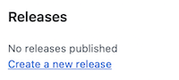
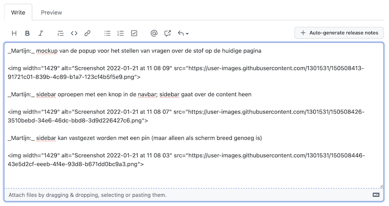

# Prototype

Je gaat nu werken aan een "eerste versie" van je project. Aan het eind van de week bestaan de belangrijkste pagina's, maar hangt alles nog met draadjes en elkaar, en is het okee als er nog een boel bugs bestaan. Het belangrijkste is dat er stappen zijn gezet, en je tegen de eerste problemen bent aangelopen. Zo kan er in het voortgangsgesprek goed worden bijgeschaafd aan het project.

## Procesboek

Tijdens deze en volgende week is het **verplicht** om dagelijks een procesboek bij te houden. Dit kan niet achteraf geschreven worden. Zie [procesboek](/milestones/process) voor de instructies.

## Voorbereiding voortgangsgesprek

Zorg dat je in de eerste paar dagen nadenkt of het door jou vastgelegde doel in het project haalbaar is, welke hulp je nodig hebt en waar je nog feedback wil hebben. Breng dit allemaal in bij het voortgangsgesprek (en alle gespreken die je binnen het team hebt!).

## Inleveren

Alle studenten moeten hun bijdrage (webpagina's) zelf hebben gecommit naar de git-repository van het team. **Zorg dat alle bijdragen binnen zijn voordat** je een "release" maakt volgens de stappen hieronder!

-   Ga naar jullie repository op GitHub en klik de link **Create a new release**:

    

-   Klik op de dropdown **Choose Tag** en vul `v0.1` in als versienummer. Klik dan op de `+ Create new tag` optie daaronder:

    

-   Vul bij de **Release title** in dat het om het `Prototype` gaat.

-   Vink de optie **This is a pre-release** aan.

-   Klik dan op de knop **Publish release**.

Hiermee is de release genaamd Prototype gekoppeld aan de laatste commit die bekend was op moment van aanmaken.

## Screenshots

Je gaat nu de release "editten" en screenshots toevoegen van alle functionaliteit aan de beschrijving. Zorg dat er screenshots zijn van alle pagina's en dat er kort maar duidelijk onder elk screenshot staat wie welk deel gebouwd heeft.

Je kunt de screenshots drag-and-droppen in het tekstveld. Ze worden dan automatisch geupload en er wordt een html-tag geplaatst, waarna de notes er bijvoorbeeld zo uitzien:

En dan zien de release notes er zo uit:

