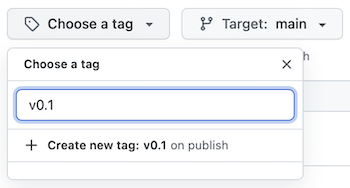
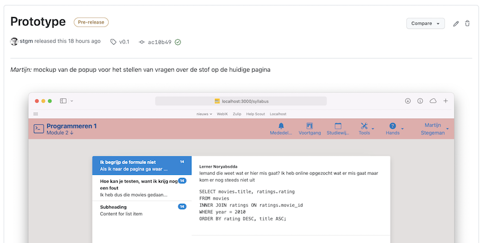

# Beta

Bij deze milestone moeten alle noodzakelijke features (en bugs) bestaan. Al het individuele werk is gedaan. Alles is al zoveel mogelijk samengevoegd tot één website. Er mogen ruwe kanten aan het project zitten en wellicht is nog niet alles even goed samengevoegd, maar alle noodzakelijke componenten bestaan. Deze milestone wordt weer besproken in een voortgangsgesprek.

Vanaf deze milestone verschuift de focus naar het afleveren van een eindproduct. Dat maakt deze milestone het einde van nieuwe features. Zo ben je vanaf nu bezig met het "polishen" en vooral testen van bestaande functionaliteit.

## Procesboek

Vergeet niet om dagelijks je procesboek bij te houden met alle details over je voortgang. 

## Voorbereiding voortgangsgesprek

Zorg dat je nadenkt of je het doel voor jou project gaat halen, welke hulp je nodig hebt en waar je nog feedback wil hebben. Breng dit allemaal in bij het voortgangsgesprek (en alle gesprekken die je binnen het team hebt!).

## Inleveren

Alle studenten moeten hun bijdrage zelf hebben gecommit naar de git-repository van het team. **Zorg dat alle bijdragen binnen zijn voordat** je een "release" maakt volgens de stappen hieronder!

-   Ga naar jullie repository op GitHub en klik de link **Create a new release**:

    

-   Klik op de dropdown **Choose Tag** en vul `v0.2` in als versienummer. Klik dan op de `+ Create new tag` optie daaronder:

    

-   Vul bij de **Release title** in dat het om de `Beta` gaat.

-   Vink de optie **This is a pre-release** aan.

-   Klik dan op de knop **Publish release**.

Hiermee is de release genaamd Beta gekoppeld aan de laatste commit die bekend was op moment van aanmaken.

## Screenshots

Je gaat nu de release "editten" en screenshots toevoegen van alle functionaliteit aan de beschrijving. Zorg dat er screenshots zijn van alle pagina's en dat er kort maar duidelijk onder elk screenshot staat wie welk deel gebouwd heeft.

Je kunt de screenshots drag-and-droppen in het tekstveld. Ze worden dan automatisch geupload en er wordt een html-tag geplaatst, waarna de notes er bijvoorbeeld zo uitzien:

En dan zien de release notes er zo uit:

