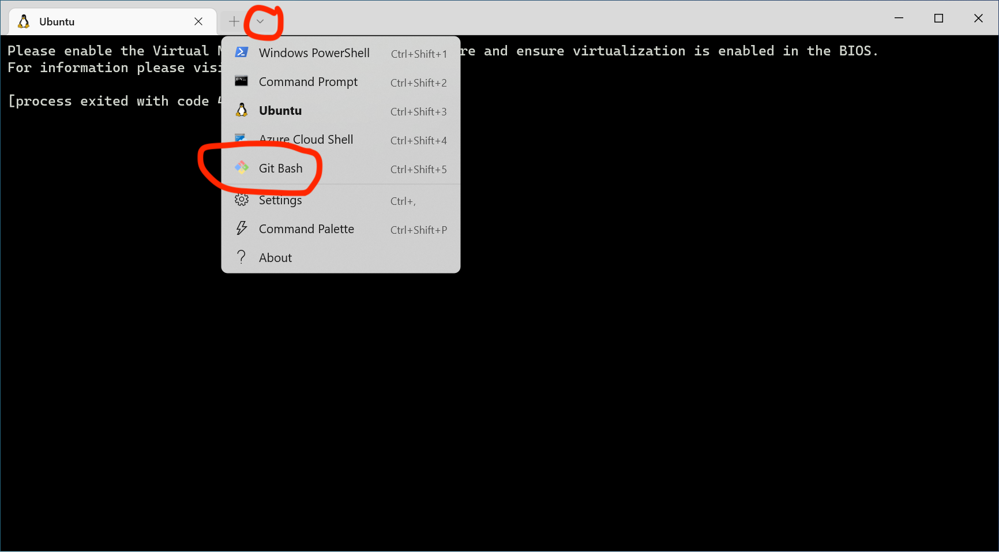

# Installatie voor Web + Data

Tijdens dit vak ga je diverse opdrachten uitvoeren in een UNIX-omgeving.
UNIX is een systeem dat speciaal is bedacht voor het snel kunnen uitvoeren en combineren van allerlei tools die teksten verwerken. Dit hoeven niet per se geschreven teksten te zijn, maar het kan ook gaan om CSV-bestanden of andere datafiles.

Sommige besturingssystemen zijn direct gebaseerd op UNIX, namelijk Linux en macOS. Heb je zo'n systeem, dan hoef je alleen een "Terminal" te openen en je kunt UNIX-commando's invoeren.

Windows is juist niet gebaseerd op UNIX, maar op Windows is het mogelijk om "Git Bash" te installeren waarmee je eigenlijk precies zoals in UNIX kunt werken. Zo heb je vrijwel precies dezelfde mogelijkheden als in Linux of macOS.

## macOS en Linux

Open de "Terminal". Deze staat tussen de programma's die al standaard geinstalleerd zijn. Ga daarna naar het kopje "Tools installeren" hieronder.

## Windows

1. Installeer eerst Windows Terminal door [deze link te volgen](https://aka.ms/terminal). Je hoeft het programma nog niet op te starten.

2. Installeer Git Bash door [deze link te volgen](https://git-scm.com/download/win). Normaal kun je de 64-bit installer downloaden, maar heel misschien werkt dat niet en moet je de 32-bit downloaden.

    - Start de installer door het gedownloade programma te klikken (Git-2.39.0.2-64-bit.exe).
    
    - **Klik bij de opties van Select Components op "(NEW) Add a Git Bash Profile to Windows Terminal".**
    
    - Als je een editor mag kiezen, selecteer dan **Nano**.
    
    - Alle andere opties kun je zo laten.
    
3. Start Windows Terminal (eerst sluiten als je 'm toch al geopend had) en open een "Git Bash"-tabblad.

    

## Tools installeren

Nadat je toegang hebt gekregen tot een goedwerkende terminal voor UNIX-commando's kun je het volgende commando copy-pasten en uitvoeren door op ENTER te drukken.

Hiermee wordt een script gedownload dat twee tools installeert voor opdrachten later in de cursus.

    /bin/bash -c "$(curl -fsSL https://raw.githubusercontent.com/uvapl/installer/main/web.sh)"

Dit script werkt niet op Linux.

Het script installeert de tools [pup](https://github.com/ericchiang/pup) en [SQLite](https://www.sqlite.org/index.html) zodat je deze in de terminal kunt gebruiken.

Als het script is afgelopen zou je `pup` moeten kunnen opstarten door dit commando te geven:

    pup --help

Dan verschijnt zo'n soort melding:

    Usage
        pup [flags] [selectors] [optional display function]
    Version
        0.4.0
    Flags
        -c --color         print result with color
        -f --file          file to read from
        -h --help          display this help
        -i --indent        number of spaces to use for indent or character
        -n --number        print number of elements selected
        -l --limit         restrict number of levels printed
        -p --plain         don't escape html
        --pre              preserve preformatted text
        --charset          specify the charset for pup to use
        --version          display version

Als dat bij jou ook zo is ben je helemaal klaar. Mocht het niet lukken, vraag dan hulp, maar voor de volgende opdrachten heb je sowieso nog geen werkende terminal nodig! Daarvoor ga je hoofdstukken lezen en daar vragen over beantwoorden.
