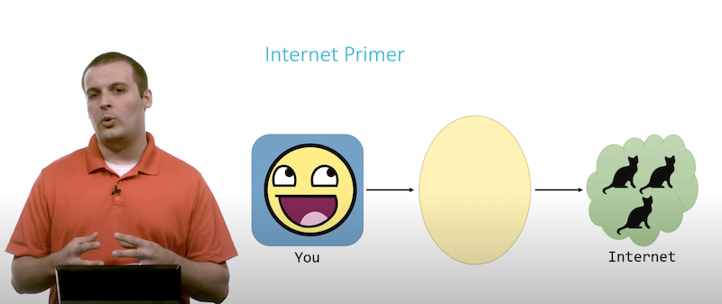
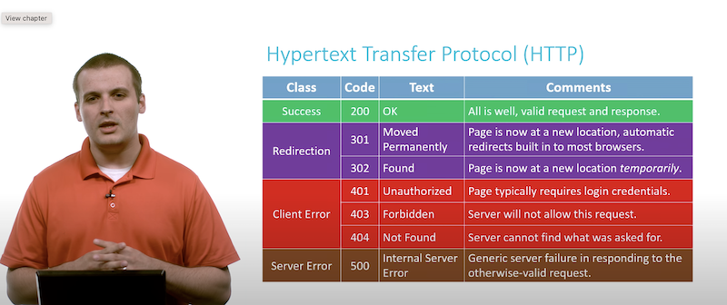
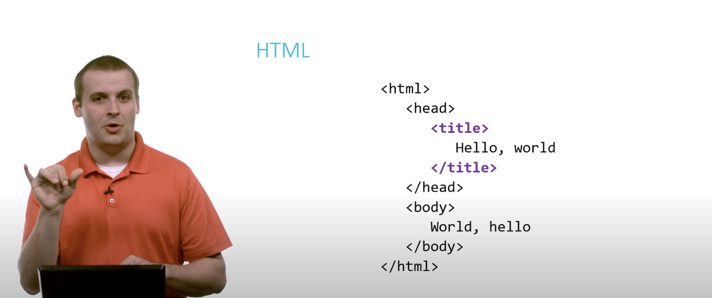
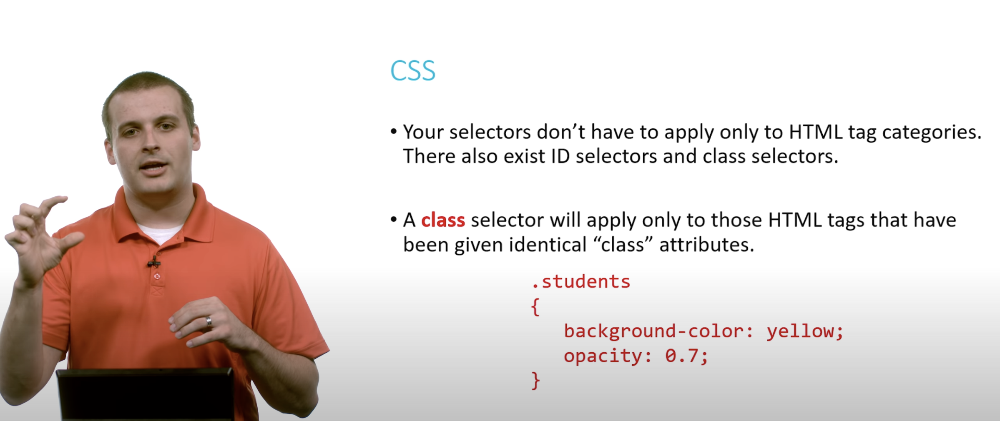

# HTML, CSS en JavaScript

In deze module ga leren hoe het internet werkt, zodat je weet wat er gebeurt als je op jouw computer een webpagina opvraagt. Daarnaast ga je nieuwe talen leren waarmee webpagina's gebouwd worden.

Voor de filmpjes danken we Doug Lloyd van Harvard!

## Internet

## HTTP

## HTML

## CSS

